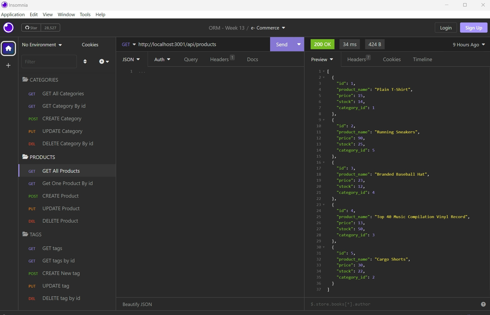
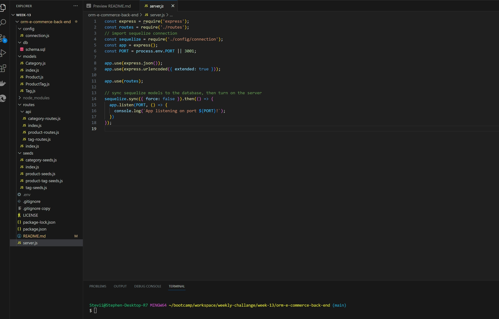

# orm-e-commerce-back-end

## Description
This week, I was tasked in completing an application, that was given, with codes which allows internet retail companies to utilize a MySQL database to retain an up-to-date record of certain categories, goods, and tags linked to their e-commerce business's sale and inventory. This application uses Node.js, Express.js, JavaScript, MySQL, and Sequelize (ORM) and utilizes the node package manager (npm) dependencies, sequelize, mysql2, express, dotenv, and nodemon. Also, the Insomnia was the application used to test the functionality of routes within the program.

## Table of Contents
* [Installation](#installation)
* [Usage](#usage)
* [License](#license)
* [Questions](#questions)

## Installation

* First you will need to clone this repository to your computer. [Link](https://github.com/slmov215/orm-e-commerce-back-end)
* Next, open VS code. 
  - [Click Here](https://code.visualstudio.com/) If you do not have it installed. 

    
* Proceed by opening your terminal and run the command "npm i' to install the required dependencies listed in the package.json file. 
  - Also, you will need to add a .env file within the root directory of the repository.
    - Inside this file, please include your environmental variables, specifying the database name, your MySQL username, and your MySQL password. 
      - This is require to be completed before running the application, and will allow the connection.js file to use your environmental variables while keeping your sensitive information protected.
* After you've downloaded the packages, run the command "mysql -u root -p" in the terminal and enter your personal MySQL password.
* Run the command, "source schema.sql" , where it will create the database.
* In the terminal, you will then need to seed the database by running the command "npm run seed".

## Usage
* Open terminal from the "index.js" file
* Once the database has been seeded, start the server by running the command "npm start".
* Then, you can then use programs like Insomnia to test the operation of the program's routes.

### Refer to the video demonstration below, where it will show the full functionality of the application.
[Click here to watch]()

Click here for the [Google Drive's link](https://drive.google.com/file/d/1eaULOFH0zlpa2UldtQKkOjO_DuH7AFpD/view?usp=drive_link)

## License
[MIT License](https://opensource.org/licenses/MIT)

## Questions

[Review my other projects on GitHub.](https://www.github.com/slmov215)

[Email me](mailto:slmov215@gmail.com)
